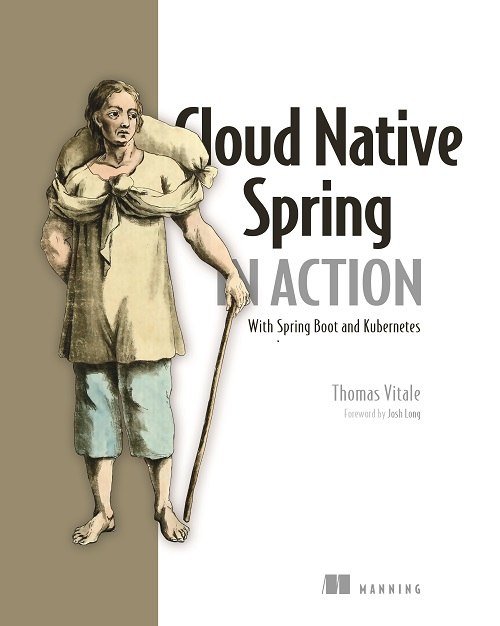

# 🍃 Cloud Native Spring in Action

- This repository contains my own incremental development of the source code accompanying the book 
[Cloud Native Spring in Action - With Spring Boot and Kubernetes](https://www.manning.com/books/cloud-native-spring-in-action) 
written by [Thomas Vitale](https://www.thomasvitale.com/) and published by Manning Publications.
- If you want to follow the examples of that book your best option is to fork the original sourcecode repository from the author at 
[https://github.com/ThomasVitale/cloud-native-spring-in-action](https://github.com/ThomasVitale/cloud-native-spring-in-action)
- The most important difference in this particular codebase is the usage of maven instead of gradle.
- I have currently progressed up to chapter 3 of the book.

## Prerequisites

Chapter after chapter, you'll build, containerize, and deploy cloud native applications. Along the journey, you will need the following software installed.

* Java 17+
    * OpenJDK: [Eclipse Temurin](https://adoptium.net)
    * GraalVM: [GraalVM](https://www.graalvm.org)
    * JDK Management: [SDKMAN](https://sdkman.io)
* Docker 20.10+
    * [Docker for Linux](https://docs.docker.com/engine/install/ubuntu/)
    * [Docker Desktop for Mac](https://www.docker.com/products/docker-desktop)
    * [Docker Desktop for Windows](https://www.docker.com/products/docker-desktop)
* Kubernetes 1.24+
    * [kubectl](https://kubernetes.io/docs/tasks/tools/install-kubectl/)
    * [minikube](https://minikube.sigs.k8s.io/docs/)
* Other
    * [HTTPie](https://httpie.org/)

## Gradle and Maven

The code samples in the book use Gradle as the build tool. Should you prefer Maven, here's a table mapping Gradle commands to Maven so that you can easily follow along.

Gradle | Maven
------ | ------
`./gradlew clean` | `./mvnw clean`
`./gradlew build` | `./mvnw install`
`./gradlew test` | `./mvnw test`
`./gradlew bootJar` | `./mvnw spring-boot:repackage`
`./gradlew bootRun` | `./mvnw spring-boot:run`
`./gradlew bootBuildImage` | `./mvnw spring-boot:build-image`

## Guides, Tools and Tips

* [Configuring IntelliJ IDEA](https://github.com/ThomasVitale/cloud-native-spring-in-action/tree/main/Guides/configuring-intellij-idea.md)
* [Configuring Visual Studio Code](https://github.com/ThomasVitale/cloud-native-spring-in-action/tree/main/Guides/configuring-visual-studio-code.md)
* [Observability setup on Kubernetes](https://github.com/ThomasVitale/cloud-native-spring-in-action/tree/main/Guides/grafana-observability-stack)
* [Replacing Kubeval with Kubeconform](https://github.com/ThomasVitale/cloud-native-spring-in-action/tree/main/Guides/replacing-kubeval-with-kubeconform.md)
* [Setting up a Kubernetes cluster for Polar Bookshop on Azure](#)
* [Setting up a Kubernetes cluster for Polar Bookshop on DigitalOcean](#)
* [Working with macOS on Apple Silicon](https://github.com/ThomasVitale/cloud-native-spring-in-action/tree/main/Guides/working-with-macos-on-apple-silicon.md)
* [Working with Windows](https://github.com/ThomasVitale/cloud-native-spring-in-action/tree/main/Guides/working-with-windows.md)

## Polar Bookshop

The final project developed throughout the book is available [here](https://github.com/ThomasVitale/cloud-native-spring-in-action/tree/main/PolarBookshop).

You can find the source code for the Angular frontend [here](https://github.com/PolarBookshop/polar-ui/tree/v1).

## Book Forum

Feel free to submit questions, feedback, or errata to the forum dedicated to "Cloud Native Spring in Action": https://livebook.manning.com/book/cloud-native-spring-in-action/.

## Contact the Author

You are very welcome to contact me for questions, feedback, or suggestions. Feel free to reach out to me on [Twitter](https://twitter.com/vitalethomas), [LinkedIn](https://www.linkedin.com/in/vitalethomas), [Mastodon](https://mastodon.online/@thomasvitale), or here on [GitHub](https://github.com/ThomasVitale/).
