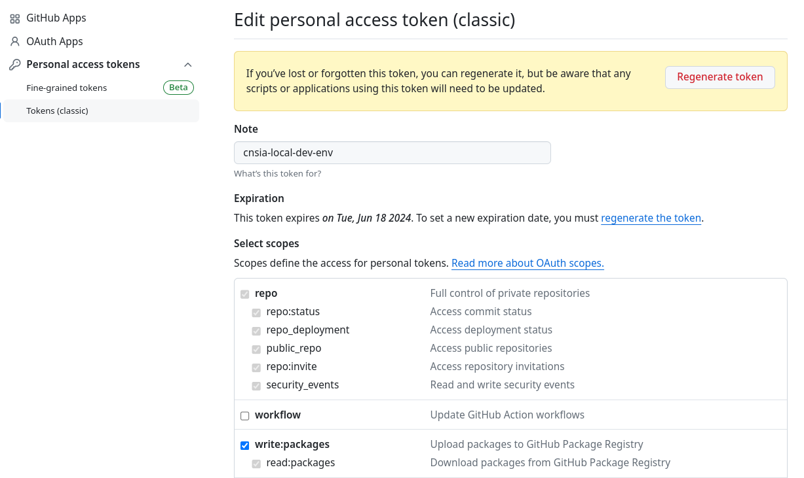

<style>
body {
  font-family: "Gentium Basic", Cardo, "Linux Libertine o", "Palatino Linotype", Cambria, serif;
  font-size: 130% !important;
}
code {
	padding: 0 .25em;
	
	white-space: pre;
	font-family: "Tlwg mono", Consolas, "Liberation Mono", Menlo, Courier, monospace;
	
	background-color: #ECFFFA;
	//border: 1px solid #ccc;
	//border-radius: 3px;
}

kbd {
	display: inline-block;
	padding: 3px 5px;
	font-family: "Tlwg mono", Consolas, "Liberation Mono", Menlo, Courier, monospace;
	line-height: 10px;
	color: #555;
	vertical-align: middle;
	background-color: #ECFFFA;
	border: solid 1px #ccc;
	border-bottom-color: #bbb;
	border-radius: 3px;
	box-shadow: inset 0 -1px 0 #bbb;
}

h1,h2,h3,h4,h5 {
  color: #269B7D; 
  font-family: "fira sans", "Latin Modern Sans", Calibri, "Trebuchet MS", sans-serif;
}

img {
  width: auto; 
  height: 80%;
  max-height: 100%; 
}
</style>

# Create or renew a GitHub PAT

## Maintenance on your GitHub account
Publishing images to the GitHub Container Registry requires you to be authenticated,
and for that you’ll need a personal access token (PAT). Go to your GitHub account,
navigate to Settings > Developer Settings > Personal access tokens, and choose Generate New Token. Input a meaningful 
name, and assign it the write:packages scope to
give the token permissions to publish images to the container registry.

Finally, generate the token and copy its value. GitHub will show you the token value
only once. Make sure you save it, because you’ll need it soon.

## Use your PAT to login into `ghrc.io/wjc-van-es`
- `docker login ghcr.io`
  - you will be prompted for your username `wjc-van-es`
  - and password, which is the PAT you just created.
  - after the message `login Succeeded` you can continue with 
- `docker push ghcr.io/wjc-van-es/catalog-service:0.0.4-SNAPSHOT`
```bash
willem@linux-laptop:~/git/cnsia$ docker push ghcr.io/wjc-van-es/catalog-service:0.0.4-SNAPSHOT
The push refers to repository [ghcr.io/wjc-van-es/catalog-service]
1dc94a70dbaa: Preparing 
2fc0f17fe631: Preparing 
e13d418b1f97: Preparing 
5f70bf18a086: Preparing 
9bb9641f7468: Preparing 
8a2bae6f5391: Preparing 
893f4b853074: Preparing 
ef35bd951312: Preparing 
366ce7d1a7f9: Preparing 
893f4b853074: Pushed 
6baad2bb9a94: Pushed 
417e5bfc3c82: Pushed 
63947728e20f: Pushed 
bea0a3dc2651: Pushed 
59ba1f666b34: Pushed 
000f6b628e38: Pushed 
e3d4978d65c3: Pushed 
57d8e19b3d8a: Pushed 
3586a6217bac: Pushed 
5498e8c22f69: Pushed 
0.0.4-SNAPSHOT: digest: sha256:76c0fe11a107bd1a5c085c0287ad6269693d69b35e100cb8f0b4945813bb7f0e size: 4706
willem@linux-laptop:~/git/cnsia$ 

```

### `docker login ghcr.io` when the PAT is renewed
`docker login ghcr.io` will attempt to login with the credentials stored in `~/.docker/config.json` and fail
but you will be prompted to retry with new credentials:
```bash
willem@linux-laptop:~/git/cnsia$ docker login ghcr.io
Authenticating with existing credentials...
Login did not succeed, error: Error response from daemon: Get "https://ghcr.io/v2/": denied: denied
WARNING! Your password will be stored unencrypted in /home/willem/.docker/config.json.
Configure a credential helper to remove this warning. See
https://docs.docker.com/engine/reference/commandline/login/#credential-stores

Username (wjc-van-es): wjc-van-es
Password: 
WARNING! Your password will be stored unencrypted in /home/willem/.docker/config.json.
Configure a credential helper to remove this warning. See
https://docs.docker.com/engine/reference/commandline/login/#credential-stores

Login Succeeded
willem@linux-laptop:~/git/cnsia$ 

```
