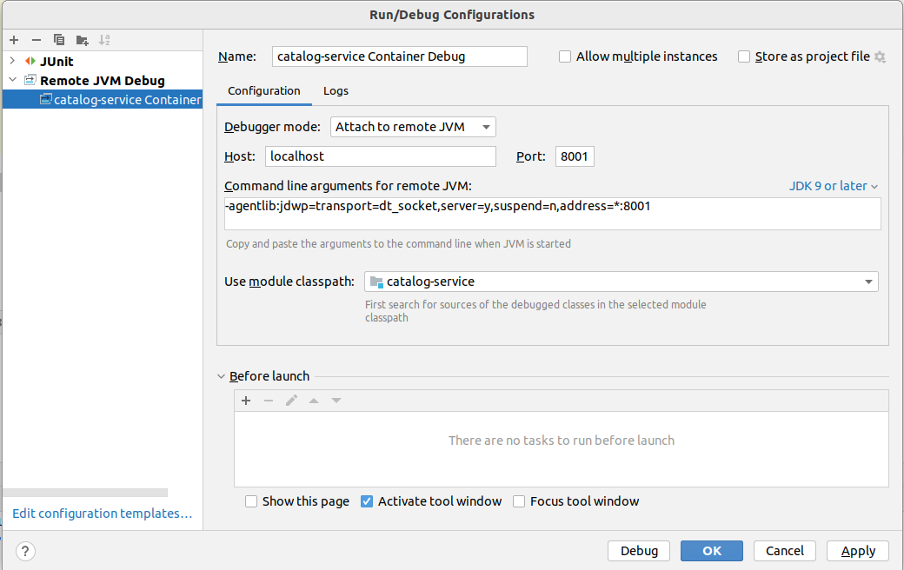

<style>
body {
  font-family: "Gentium Basic", Cardo, "Linux Libertine o", "Palatino Linotype", Cambria, serif;
  font-size: 130% !important;
}
code {
	padding: 0 .25em;
	
	white-space: pre;
	font-family: "Tlwg mono", Consolas, "Liberation Mono", Menlo, Courier, monospace;
	
	background-color: #ECFFFA;
	//border: 1px solid #ccc;
	//border-radius: 3px;
}

kbd {
	display: inline-block;
	padding: 3px 5px;
	font-family: "Tlwg mono", Consolas, "Liberation Mono", Menlo, Courier, monospace;
	line-height: 10px;
	color: #555;
	vertical-align: middle;
	background-color: #ECFFFA;
	border: solid 1px #ccc;
	border-bottom-color: #bbb;
	border-radius: 3px;
	box-shadow: inset 0 -1px 0 #bbb;
}

h1,h2,h3,h4,h5 {
  color: #269B7D; 
  font-family: "fira sans", "Latin Modern Sans", Calibri, "Trebuchet MS", sans-serif;
}
</style>

# Chapter 6 - Containerizing Spring Boot
With focus on
- Creating Docker images
- Docker compose

## 6.2 - Packaging Spring Boot applications as container images

### 6.2.2 - Containerizing Spring Boot with Dockerfiles

### 6.2.3 - Building container images for production
We can use a command to extract all classes and jar file dependencies from the Spring Boot uber jar we build with maven
`java -Djarmode=layertools -jar $JAR_FILE_PATH extract` and we will use this in our multistage Dockerfile.

Moreover, there is a command to just list all the directories created in the extraction that each represent a different
layer when we place each of these in a separate COPY instruction of the Dockerfile: 
`java -Djarmode=layertools -jar $JAR_FILE_PATH list`. The order of the directories in the list will be the order
in which you need to place the COPY instructions of the Dockerfile.
- `dependencies`
- `spring-boot-loader`
- `snapshot-dependencies`
- `application`

In order to know what is being done in the image building stages it may be instructive to try it out in a CLI on the
container host:
```bash
~/git/cnsia/catalog-service$ sdk env

Using java version 17.0.6-tem in this shell.
~/git/cnsia/catalog-service$ mkdir jar_extracts
~/git/cnsia/catalog-service$ java -Djarmode=layertools \
    -jar target/catalog-service-0.0.1-SNAPSHOT.jar extract && \
    mv -t jar_extracts/ \
    $(java -Djarmode=layertools -jar target/catalog-service-0.0.1-SNAPSHOT.jar list)

```
- The two-staged [../catalog-service/Dockerfile](../catalog-service/Dockerfile) uses the principles of dividing libraries that change often
from libraries that change seldom by copying each in their own image layer. 
- Moreover, a spring user is introduced to substitute for the root user to increase safety by adhering to the principle 
  of least privilege.

The Dockerfile now looks like this:
```dockerfile
## 2-stage build

## first stage acquire and extract the uberjar build with maven on the container host
# Set root image
FROM eclipse-temurin:17 AS builder

# Set working directory
WORKDIR workspace

# The path to the jar file, which can be overridden with a --build-arg argument of the docker build command
ARG JAR_FILE=target/*.jar

# Copy the uberjar into an image layer
COPY ${JAR_FILE} catalog-service.jar

# extract the uber jar into another image layer
RUN java -Djarmode=layertools -jar catalog-service.jar extract


## second stage copy all extracted directories into a separate layer discarding the rest of the first stage
FROM    eclipse-temurin:17

# create and assign spring as user instead of the default root
# before copying everything into the working dir (so it will be owned by the spring user
# and the spring user will start the process defined by the ENTRYPOINT
RUN useradd spring
USER spring
WORKDIR workspace

# Copy each directory in a separate layer in the right order:
# from changing least often to most often and necessasitating a new image build
COPY --from=builder workspace/dependencies/ ./
COPY --from=builder workspace/spring-boot-loader/ ./
COPY --from=builder workspace/snapshot-dependencies/ ./
COPY --from=builder workspace/application/ ./

# running the Spring Boot JarLauncher class
ENTRYPOINT ["java", "org.springframework.boot.loader.JarLauncher"]
```

#### Commands to run a `polar-postgres` and a `catalog-service` container
Provided there are already the 
- bla volume and
- bla network

```bash
~/git/cnsia/catalog-service$ docker build -t catalog-service .
~/git/cnsia/catalog-service$ docker run -d --rm \
    --name polar-postgres \
    -v polar-postgres:/var/lib/postgresql/data \
    --net catalog-network \
    -e POSTGRES_USER=user \
    -e POSTGRES_PASSWORD=password \
    -e POSTGRES_DB=polardb_catalog \
    -p 5432:5432 \
    postgres:15.3
ffbc867a817a23f5b662c8b106bae42309bef040b7e6102c45f6d686c53c35d7
~/git/cnsia/catalog-service$ docker run -d --rm \
    --name catalog-service \
    --net catalog-network \
    -p 9001:9001 \
    -e SPRING_DATASOURCE_URL=jdbc:postgresql://polar-postgres:5432/polardb_catalog \
    catalog-service:latest
b19082b49c2a881f50d83566e820c1b5a8ff27634864ea9262c40a1a9cb354bb
~/git/cnsia/catalog-service$ docker ps -a
CONTAINER ID   IMAGE                    COMMAND                  CREATED          STATUS          PORTS                                       NAMES
b19082b49c2a   catalog-service:latest   "java org.springfram…"   9 seconds ago    Up 8 seconds    0.0.0.0:9001->9001/tcp, :::9001->9001/tcp   catalog-service
ffbc867a817a   postgres:15.3            "docker-entrypoint.s…"   35 seconds ago   Up 35 seconds   0.0.0.0:5432->5432/tcp, :::5432->5432/tcp   polar-postgres
~/git/cnsia/catalog-service$

```

#### installing and using `grype` to check local images for security risks
From [https://lindevs.com/install-grype-on-ubuntu](https://lindevs.com/install-grype-on-ubuntu) we gather we can
install `grype` with:
```bash
$ wget -qO - https://raw.githubusercontent.com/anchore/grype/main/install.sh | sudo bash -s -- -b /usr/local/bin
```
Now we can check for vulnerabilities in the images
```bash
$ grype catalog-service

$ grype postgres:15.3
```
The highest level for `catalog-service` is high on:
```bash
NAME                       INSTALLED                     FIXED-IN            TYPE          VULNERABILITY        SEVERITY
snakeyaml                  1.33                          2.0                 java-archive  GHSA-mjmj-j48q-9wg2  High
```
This is due because of Spring Boot 3.1.1 still supporting this library version. We will upgrade to the new version
of Spring Boot as soon as it is released.

The highest level for `postgres:15.3` is high on:
```bash
NAME                            INSTALLED          FIXED-IN                 TYPE       VULNERABILITY        SEVERITY
github.com/opencontainers/runc  v1.1.0             1.1.5                    go-module  GHSA-vpvm-3wq2-2wvm  High        
libldap-2.5-0                   2.5.13+dfsg-5      (won't fix)              deb        CVE-2023-2953        High        
libperl5.36                     5.36.0-7           (won't fix)              deb        CVE-2023-31484       High        
libxml2                         2.9.14+dfsg-1.2    2.9.14+dfsg-1.3~deb12u1  deb        CVE-2022-2309        High        
perl                            5.36.0-7           (won't fix)              deb        CVE-2023-31484       High        
perl-base                       5.36.0-7           (won't fix)              deb        CVE-2023-31484       High        
perl-modules-5.36               5.36.0-7           (won't fix)              deb        CVE-2023-31484       High
```
The most recent image for postgres is still 15.3

### 6.2.4 Containerizing Spring Boot with Cloud Native Buildpacks
For now, we have the following setting in [../catalog-service/pom.xml](../catalog-service/pom.xml)
- Using [https://docs.spring.io/spring-boot/docs/current/maven-plugin/reference/htmlsingle/#goals-build-image](https://docs.spring.io/spring-boot/docs/current/maven-plugin/reference/htmlsingle/#goals-build-image)
- `${module.image.name}` includes the repository name and the repository account namespace
- Furthermore, `${project.version}` is used as tag
- We may use automatic pushing to ghcr.io using this example: 
  [https://stackoverflow.com/questions/64849028/maven-spring-boot-cannot-push-docker-image](https://stackoverflow.com/questions/64849028/maven-spring-boot-cannot-push-docker-image)
- Currently, we pushed manually without any problems: `docker push ghcr.io/wjc-van-es/catalog-service:0.0.1-SNAPSHOT`
```xml
<project>
  ...
  <properties>
    ...
    <module.image.name>ghcr.io/wjc-van-es/${project.name}</module.image.name>
  </properties>
  <build>
    <plugins>
      <plugin>
        <groupId>org.springframework.boot</groupId>
        <artifactId>spring-boot-maven-plugin</artifactId>
        <configuration>
          <!--<imageName>${module.image.name}</imageName>-->
          <image>
            <name>${module.image.name}:${project.version}</name>
            <env>
              <BP_JVM_VERSION>17.*</BP_JVM_VERSION>
            </env>
          </image>
        </configuration>
      </plugin>
    </plugins>
  </build>
</project>
```

### 6.3.2 Debugging Spring Boot containers
#### Set up
Just set up [../catalog-service/docker-compose.yml](../catalog-service/docker-compose.yml) with
- the extra port mapping `8001:8001` and
- the two extra **_Paketo Buildpacks_** environment variables:
  - `BPL_DEBUG_ENABLED=true`
  - `BPL_DEBUG_PORT=8001`
- Now setting up the **IntelliJ** with the **_catalog-service Container Debug_** configuration
  
- Also put the Request timeout (ms) of the **Insomnia** HTTP test client to 300000 ( = 300000 / (60 * 1000) = 5 minutes)
  Through the menu _Application > Preferences > General tab (scroll down to the header **Request / Response**)_

#### Testing it
- From the directory with the docker-compose.yml `docker compose up -d`
- Start the **_catalog-service Container Debug_** in **IntelliJ**
- Set some breakpoints in 
  [com.polarbookshop.catalogservice.domain.BookService#editBookDetails](../catalog-service/src/main/java/com/polarbookshop/catalogservice/domain/BookService.java)
  and
- Send an HTTP PUT request from **Insomnia** and you can step through the method and see the available data from the
  request body and the database retrieval.
- When you finish the debug session within 5 minutes you will get the appropriate response back in Insomnia
- Once you stop the **_catalog-service Container Debug_** in **IntelliJ** session in the IDE you can continue sending 
  Put requests and get fast responses without any debug breakpoint suspensions. So you can keep your
  [../catalog-service/docker-compose.yml](../catalog-service/docker-compose.yml) set up without any responsiveness
  penalty when the **IntelliJ** **_catalog-service Container Debug_** session isn't running.
- When you're done stop the containers with `docker compose down`

## 6.4 Deployment pipeline: Package and publish

### 6.4.2 Publishing container images with GitHub Actions
#### Setting up the GitHub Actions instructions back in chapter 3 and adjustments made on the book's example
We took most of the example of the GitHub Actions instructions in commit-stage.yml.
In chapter 3 we had to reinvent these instructions for Maven instead of Gradle for which we chose the Java with Maven 
workflow from the 
[https://github.com/wjc-van-es/cnsia/actions/new?category=continuous-integration](https://github.com/wjc-van-es/cnsia/actions/new?category=continuous-integration)
examples page. This created a .github/workflows/maven.yml file. Now we have renamed this to 
[../.github/workflows/commit-stage.yml](../.github/workflows/commit-stage.yml) to better reflect the CI/ CD stages
defined by the 15-Factor methodology.

Among the adjustments we had to make
The root directory of the git repository contains the `.github/workflows/commit-stage.yml`, but not 
- the root of the source code `src/`, that's in `catalog-service/src/`
- the `pom.xml`, that's at `catalog/pom.xml`.

This means that 
- in step 3 and step 6 `"${{ github.workspace }}"` needs to be replaced with
  `"${{ github.workspace }}/catalog-service"`
- in `Step 5 - Build with Maven` a `cd catalog-service` is added at the `run` instruction

#### Adding the `package` job to [`../.github/workflows/commit-stage.yml`](../.github/workflows/commit-stage.yml)
Now we took over the new `package` job with some notable adjustments
- we added step numbers to the step names
- We use `runs-on: ubuntu-latest` instead of `runs-on: ubuntu-22.04`
- **_Step 3 - Build container image with maven_** uses Maven instead of Gradle
  - One complication is that the `image.name` property configured in the plugin 
    `org.springframework.boot:spring-boot-maven-plugin` of the pom file cannot be overridden on the command line
    - hence, `mvn spring-boot:build-image -DimageName=ghcr.io/wjc-van-es/catalog-service:latest` doesn't work, when
      tested in a localhost terminal
    - The work-around is to declare a project scoped property `module.image.name` and refer to that inside the
      `org.springframework.boot:spring-boot-maven-plugin` plugin configuration (using `${module.image.name}`).
    - Now overriding `module.image.name` on the command line can be done with Maven:
      `mvn spring-boot:build-image -Dmodule.image.name=ghcr.io/wjc-van-es/catalog-service:latest`
    - See [https://stackoverflow.com/questions/74043878/spring-boot-maven-plugin-cannot-override-arguments-set-in-pom-xml](https://stackoverflow.com/questions/74043878/spring-boot-maven-plugin-cannot-override-arguments-set-in-pom-xml)
    - 

